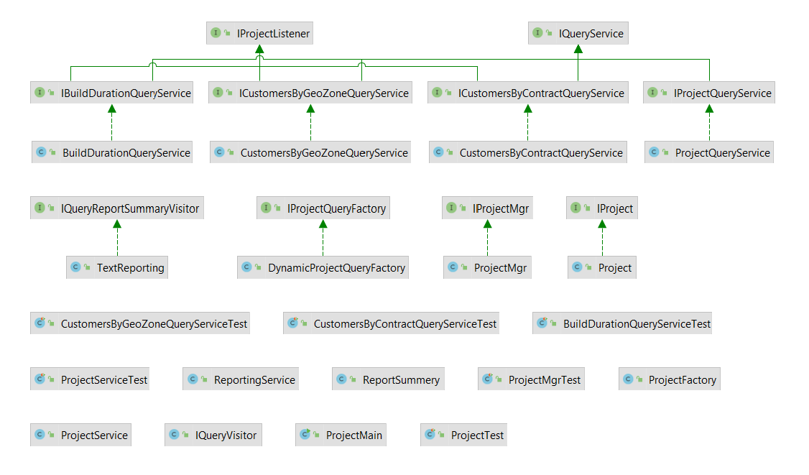

# ProjectInformation

This a small project for organising project data such a way that project details can be retrieved efficiently.

Given project data will be processed and stored into the system.

The Main Class of the project is **ProjectMain**.

##### Input
Input for the project can be given from file "input/ProjectData.txt" in the project.
Structure of incoming data:

The data is organized into columns delimited by a comma(,) in the following order:

customerId,contractId,geozone,teamcode,projectcode,buildduration

##### Class Diagram of the project

